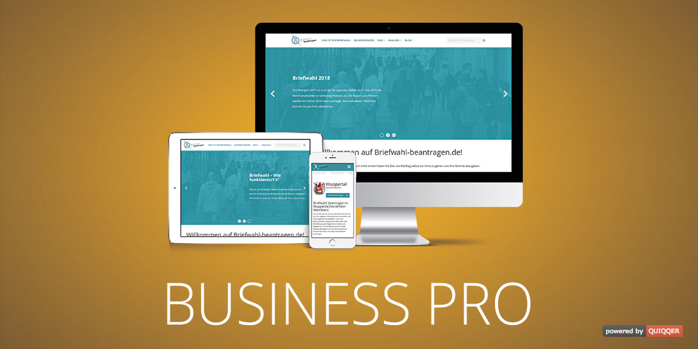

QUIQQER Business Pro
====================

This template allow you to create a modern and responsive website.
Thanks to many settings you can simply adjust this template to yours needs.

Paketname:

    quiqqer/template-businesspro

Features
--------

- Responsive
- Integrated QUIQQER breadcrumb
- Page transition effects
- Search icon / input in the top navigation
- FontAwesome support
- Placeholder for your socials in the navigation and footer
    - Facebook
    - Twitter
    - Google Plus
    - YouTube
    - GitHub
    - GitLab
- Color management
- Header settings (show / hide, height, position, etc.)
- Each site can define if header, title and short description should be displayed (override the global setting)
- Template settings cache

Installation
------------

The package name is: quiqqer/template-businesspro

Contribute
----------

- Issue Tracker: https://dev.quiqqer.com/quiqqer/template-businesspro/issues 
- Source Code: https://dev.quiqqer.com/quiqqer/template-businesspro

Support
-------

If you have found a bug or want to make improvements,
then you can write an e-mail to support@pcsg.de.

License
-------

GPL-3.0+